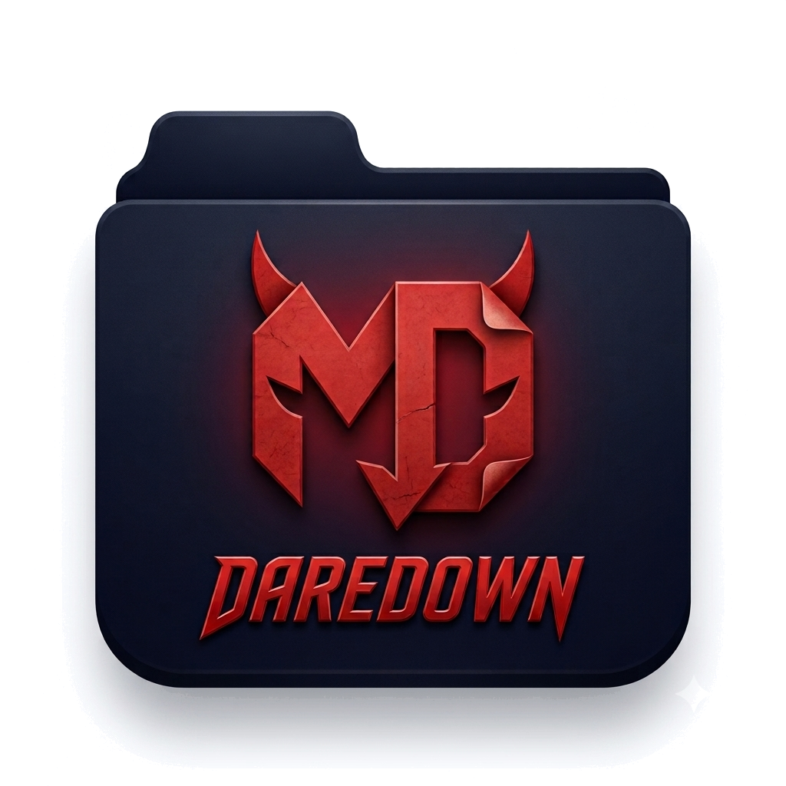

<div align="center">



# DareDown

**A markdown reader that isn't afraid of anything — not even your gnarliest .md files.**

[](https://github.com/Borduhh/DareDown/releases)
[](#offline-and-read-only-enforced)
[](LICENSE)

</div>

> **DareDown cost a *lot* of tokens to build.** If it earns a spot in your dock,
> a sponsorship keeps it getting updates.
>
> [](https://github.com/sponsors/Borduhh)

A quiet, offline desktop reader for local Markdown. View-only by design — it renders
GFM and Mermaid diagrams and stays out of the way. Electron, so it behaves identically
on macOS, Windows and Linux.

The visual target is a printed page under a lamp rather than a code editor: one
warm surface, a measured column, hairline rules, and no shadows anywhere except
the diagram modal.

## Install

Grab an installer from the [latest release](https://github.com/Borduhh/DareDown/releases/latest):

| Platform | Download |
|---|---|
| macOS (Apple silicon) | `DareDown-*-arm64.dmg` |
| macOS (Intel) | `DareDown-*.dmg` |
| Windows | `DareDown.Setup.*.exe`, or `DareDown.*.exe` to run without installing |
| Linux | `DareDown-*.AppImage`, or `daredown_*_amd64.deb` |

### macOS blocks it on first launch

DareDown is signed, but not **notarised** — that needs a paid Apple Developer
account. So the first time you open it, macOS refuses and says it cannot verify
the developer. To get past it, once:

1. Double-click DareDown and dismiss the warning. This step matters — the button
   in the next step only appears after macOS has blocked a launch attempt.
2. Open **System Settings → Privacy & Security**.
3. Scroll to the Security section, find the message about DareDown being blocked,
   and click **Open Anyway**.
4. Confirm with Touch ID or your password.

It opens normally from then on. On macOS 15 and later the old
right-click → Open shortcut no longer works for un-notarised apps; Privacy &
Security is the way. Windows shows the equivalent SmartScreen prompt — choose
**More info → Run anyway**.

### From source

```bash
git clone https://github.com/Borduhh/DareDown.git
cd DareDown
npm install
npm run open:samples
```

## What it does

**Reading.** Open a single file or a folder. In folder mode you get a Markdown-only
file tree, tabs, and quick open (`⌘P`). Relative links to other `.md` files open in
a new tab — including extension-less and `dir/README.md`-style links, the way
documentation sites write them.

**One left pane, two views.** The file tree and the heading outline share the
sidebar; the `Files` / `Outline` tabs at its top switch between them, as does
`⇧⌘B`. The outline tracks your position as you scroll and jumps on click.

**Width.** Either set a reading measure (`⌘[` / `⌘]`, or the slider in
preferences) or hit `⌘\` for full width, which drops the measure and lets the
column fill the pane — the quick way to give a wide table or diagram more room.
Nudging the measure leaves full width again. (This is the reading column; OS
fullscreen is separate, under View.)

**GFM.** Tables with alignment, task lists, strikethrough, footnotes, autolinks,
`> [!NOTE]` alerts, YAML front matter, and syntax-highlighted fenced code with a
hover copy button. Raw HTML is allowed but sanitized.

**Mermaid.** All standard diagram types render locally — no CDN, no network. Every
diagram has hover-revealed controls (zoom out / level / zoom in / reset /
fullscreen) and opens into a fullscreen modal with click-drag panning, cursor-anchored
scroll and pinch zoom from 25% to 400%, a live zoom indicator, a reset button, and
Esc-or-click-outside to close. Diagrams are themed to the app palette rather than
Mermaid's defaults, and a diagram that fails to parse degrades to an inline error
card showing the message and its source — it never takes the page down.

**Live reload.** Open files and the workspace folder are watched with chokidar and
re-render on external edits, preserving scroll position and any zoom you set on a
diagram. Atomic saves (the write-temp-then-rename that vim and VS Code use) are
recognised as edits, not deletions.

**Memory.** Window size and position, theme, reading width and full-width mode,
text size, sidebar visibility and which sidebar view was open, and the last opened
folder and tabs all persist to one JSON file you can read or delete:

- macOS `~/Library/Application Support/DareDown/config.json`
- Windows `%APPDATA%\DareDown\config.json`
- Linux `~/.config/DareDown/config.json`

## Offline and read-only, enforced

The constraint is load-bearing, so it is enforced in three independent places:

1. Everything is bundled — Mermaid, highlight.js, markdown-it. There are no
   remote assets and no web fonts; the UI uses system font stacks.
2. The main process cancels every request whose scheme could reach the network
   (`src/main/index.js`, `installNetworkBlock`), and denies all permission requests.
3. A CSP in `src/renderer/index.html` sets `connect-src 'none'` and refuses inline
   scripts, so raw HTML inside a Markdown file cannot execute or phone home.

No telemetry, no accounts, no cloud sync. The renderer is sandboxed with
`contextIsolation` on and reaches Node only through the small, explicit bridge in
`src/main/preload.js`.

## Shortcuts

`⌘/` (`Ctrl+/`) lists them all in the app. The essentials:

| Area | Shortcut | Action |
|---|---|---|
| Files | `⌘O` / `⇧⌘O` | Open file / folder |
| Files | `⌘P` | Quick open |
| Files | `⌘R` | Reload document |
| Sidebar | `⌘B` | Show / hide sidebar |
| Sidebar | `⇧⌘B` | Switch view, files ⇄ outline |
| Sidebar | `⇧⌘E` / `⇧⌘Y` | Files / Outline directly |
| Reading | `⌘\` | Full width |
| Reading | `⌘[` `⌘]` | Narrower / wider column |
| Reading | `⌘+` `⌘-` `⌘0` | Text size |
| Reading | `⇧⌘T` | Light / dark theme |
| Navigate | `⌘F` / `⌘G` | Find in document / find next |
| Navigate | `⌘1`–`⌘9` | Jump to tab |

Inside a diagram: click to open fullscreen, drag to pan, scroll or pinch to zoom,
double-click to zoom at the pointer, `+`/`-`/`0` and arrows, `Esc` to close.
`⌘Scroll` zooms a diagram inline without leaving the page.

## Contributing

Build instructions, the source layout, the packaging and release pipeline, and
how the icons are generated all live in [CONTRIBUTING.md](CONTRIBUTING.md).

## Known limits

- Inline SVG and `<iframe>`/`<script>` in Markdown are stripped by the sanitizer.
  Mermaid is the supported route to diagrams.
- No math rendering (KaTeX/MathJax would need to be bundled; not wired up).
- No print or export.
- Mermaid is ~3 MB of the bundle. That is the price of rendering every diagram type
  offline, and it is the main reason `app.js` is as large as it is.

## Sponsoring

DareDown is free, offline and has no telemetry, so there is no business model behind
it — just tokens and evenings. If it's useful to you, [sponsoring on
GitHub](https://github.com/sponsors/Borduhh) is what funds the next round of work.

## License

MIT — see [LICENSE](LICENSE).
