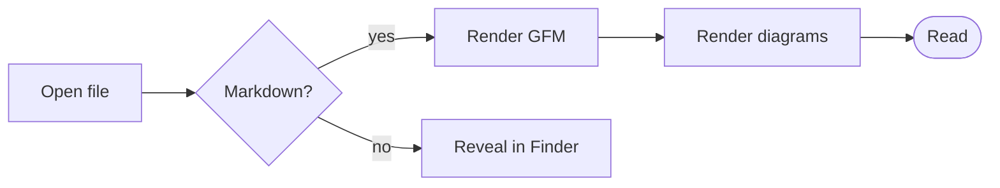

# DareDown

A markdown reader that isn't afraid of anything. This document exercises every rendering
path in the app — GFM syntax, syntax highlighting, footnotes, and the diagram
pipeline. Use it as a smoke test after any change.

See also: [Diagrams](diagrams.md) · [Typography](typography.md) · [nested doc](nested/deep.md)

## Text

Ordinary paragraphs wrap to the reading measure, which is about seventy
characters at the default width. **Bold**, *italic*, ***both***, ~~struck
through~~, `inline code`, <kbd>⌘K</kbd>, and a [link to a heading](#tables).

Autolinked bare URL: https://example.com/some/path?query=1

Footnotes work too[^first], including multiple references[^second].

[^first]: The footnote body renders at the end of the document.
[^second]: With a back-reference arrow to return to the text.

> A plain blockquote, set in italic with a hairline rule on the left.
> It runs to a second line to show the wrap.

> [!NOTE]
> GitHub-style alerts become callouts, tinted by kind.

> [!WARNING]
> Warning uses the amber hue. Caution, tip, and important each get their own.

## Task lists

- [x] Render GFM checkboxes read-only
- [x] Strike nothing, just mute the finished items
- [ ] Remain unchecked and interactive-looking but inert
  - [ ] Nested items indent correctly
  - [x] Including checked nested items

## Tables

| Feature | Status | Notes |
|---|:---:|---:|
| Tables | done | Alignment respected |
| Task lists | done | Read-only |
| Footnotes | done | With backrefs |
| Mermaid | done | 20+ diagram types |
| A deliberately long cell to force horizontal scrolling inside the table box | ok | 1,234 |

## Code

```js title="watcher.js"
// Fenced blocks get a language label and a hover-revealed copy button.
export function debounce(fn, ms) {
  let timer = null;
  return (...args) => {
    clearTimeout(timer);
    timer = setTimeout(() => fn(...args), ms);
  };
}
```

```python
def fib(n: int) -> int:
    """Docstrings, decorators and f-strings all colour correctly."""
    a, b = 0, 1
    for _ in range(n):
        a, b = b, a + b
    return a
```

```diff
- const theme = 'dark';
+ const theme = resolveTheme(prefs);
```

```
A fence with no language stays plain, with a "Text" label.
```

## A diagram



## Lists

1. Ordered lists use tabular numerals
2. So multi-digit markers stay aligned
   1. Nested ordered lists restart
   2. And indent by the same measure
3. Back to the outer level

- Unordered items use a small warm dot
- Nested levels switch to an outline dot
  - Like this one
  - And this

<details>
<summary>Raw HTML is sanitized but useful tags survive</summary>

`<details>`, `<br>`, `` and friends work. `<script>` is stripped, and so is
any `on*` attribute, regardless of what the file claims.

</details>

---

Long documents get a hairline progress bar under the title bar.

[^unused]: An unreferenced footnote still renders in the notes section.
