# Diagram gallery

Every standard Mermaid diagram type, for checking the renderer, the hover
controls, and the fullscreen pan/zoom modal. Hover a diagram for controls;
click it to open fullscreen.

Back to [README](README.md).

## Flowchart

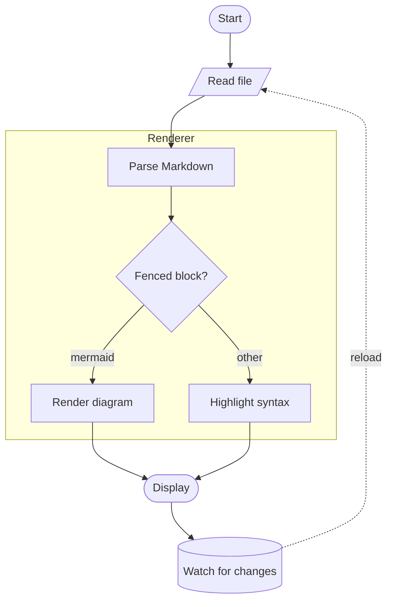
```mermaid
flowchart TD
    Start([Start]) --> Read[/Read file/]
    Read --> Parse[Parse Markdown]
    Parse --> Fence{Fenced block?}
    Fence -- mermaid --> Diagram[Render diagram]
    Fence -- other --> Highlight[Highlight syntax]
    Diagram --> Done
    Highlight --> Done
    Done([Display]) --> Watch[(Watch for changes)]
    Watch -.reload.-> Read
    subgraph Renderer
        Parse
        Fence
        Highlight
        Diagram
    end
```

## Sequence

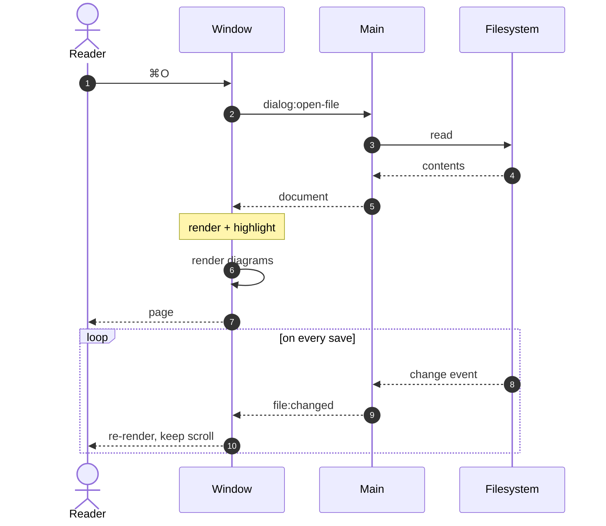
```mermaid
sequenceDiagram
    autonumber
    actor R as Reader
    participant W as Window
    participant M as Main
    participant FS as Filesystem

    R->>W: ⌘O
    W->>M: dialog:open-file
    M->>FS: read
    FS-->>M: contents
    M-->>W: document
    Note over W: render + highlight
    W->>W: render diagrams
    W-->>R: page
    loop on every save
        FS-->>M: change event
        M-->>W: file:changed
        W-->>R: re-render, keep scroll
    end
```

## Class

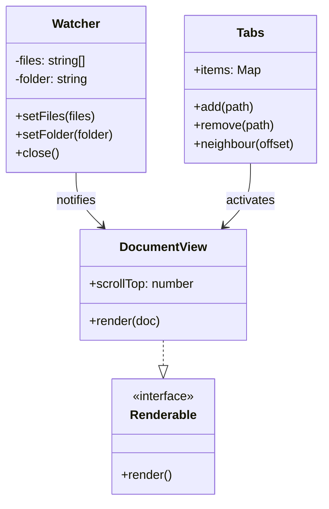
```mermaid
classDiagram
    class Watcher {
        -files: string[]
        -folder: string
        +setFiles(files)
        +setFolder(folder)
        +close()
    }
    class Tabs {
        +items: Map
        +add(path)
        +remove(path)
        +neighbour(offset)
    }
    class DocumentView {
        +render(doc)
        +scrollTop: number
    }
    Watcher --> DocumentView : notifies
    Tabs --> DocumentView : activates
    DocumentView ..|> Renderable
    class Renderable {
        <<interface>>
        +render()
    }
```

## State

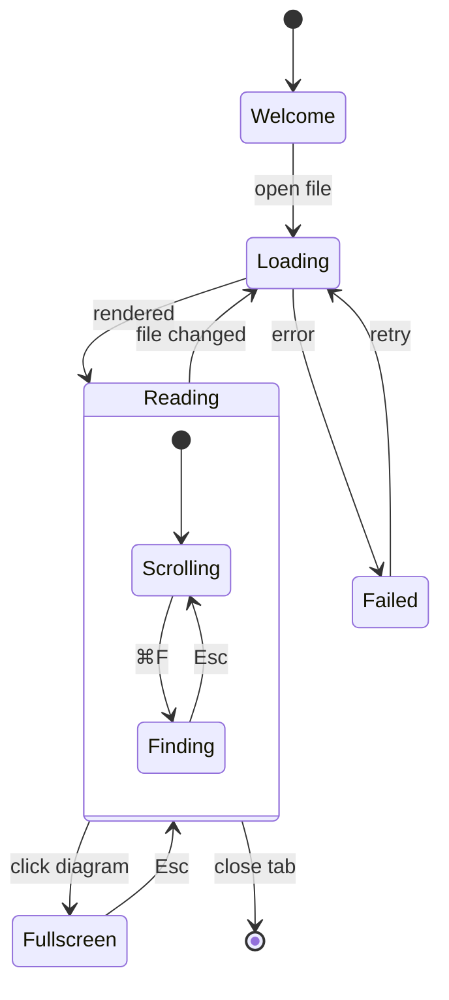
```mermaid
stateDiagram-v2
    [*] --> Welcome
    Welcome --> Loading : open file
    Loading --> Reading : rendered
    Loading --> Failed : error
    Failed --> Loading : retry
    Reading --> Loading : file changed
    Reading --> Fullscreen : click diagram
    Fullscreen --> Reading : Esc
    Reading --> [*] : close tab
    state Reading {
        [*] --> Scrolling
        Scrolling --> Finding : ⌘F
        Finding --> Scrolling : Esc
    }
```

## Entity relationship

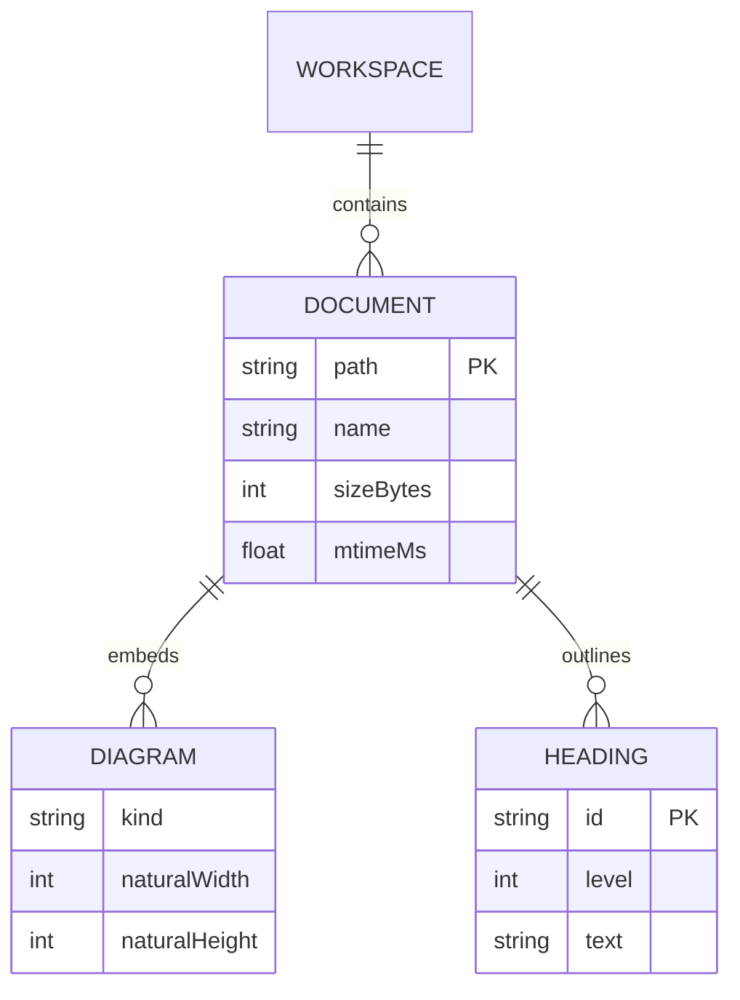
```mermaid
erDiagram
    WORKSPACE ||--o{ DOCUMENT : contains
    DOCUMENT ||--o{ DIAGRAM : embeds
    DOCUMENT ||--o{ HEADING : outlines
    DOCUMENT {
        string path PK
        string name
        int sizeBytes
        float mtimeMs
    }
    DIAGRAM {
        string kind
        int naturalWidth
        int naturalHeight
    }
    HEADING {
        string id PK
        int level
        string text
    }
```

## User journey

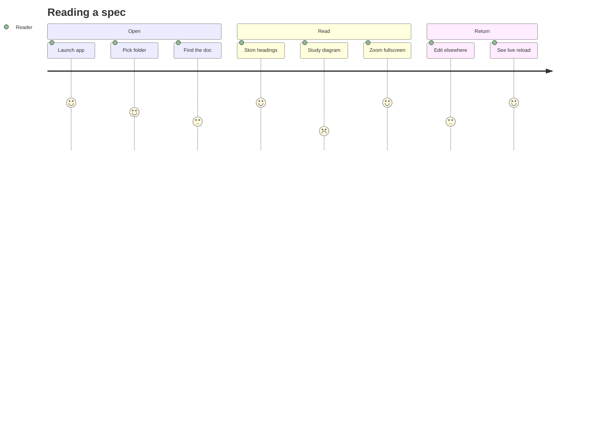
```mermaid
journey
    title Reading a spec
    section Open
      Launch app: 5: Reader
      Pick folder: 4: Reader
      Find the doc: 3: Reader
    section Read
      Skim headings: 5: Reader
      Study diagram: 2: Reader
      Zoom fullscreen: 5: Reader
    section Return
      Edit elsewhere: 3: Reader
      See live reload: 5: Reader
```

## Gantt

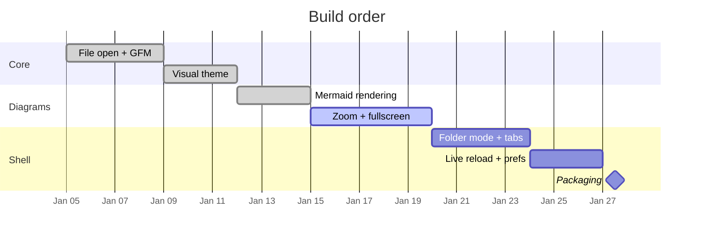
```mermaid
gantt
    title Build order
    dateFormat YYYY-MM-DD
    axisFormat %b %d
    section Core
    File open + GFM      :done, a1, 2026-01-05, 4d
    Visual theme         :done, a2, after a1, 3d
    section Diagrams
    Mermaid rendering    :done, b1, after a2, 3d
    Zoom + fullscreen    :active, b2, after b1, 5d
    section Shell
    Folder mode + tabs   :c1, after b2, 4d
    Live reload + prefs  :c2, after c1, 3d
    Packaging            :milestone, c3, after c2, 1d
```

## Pie

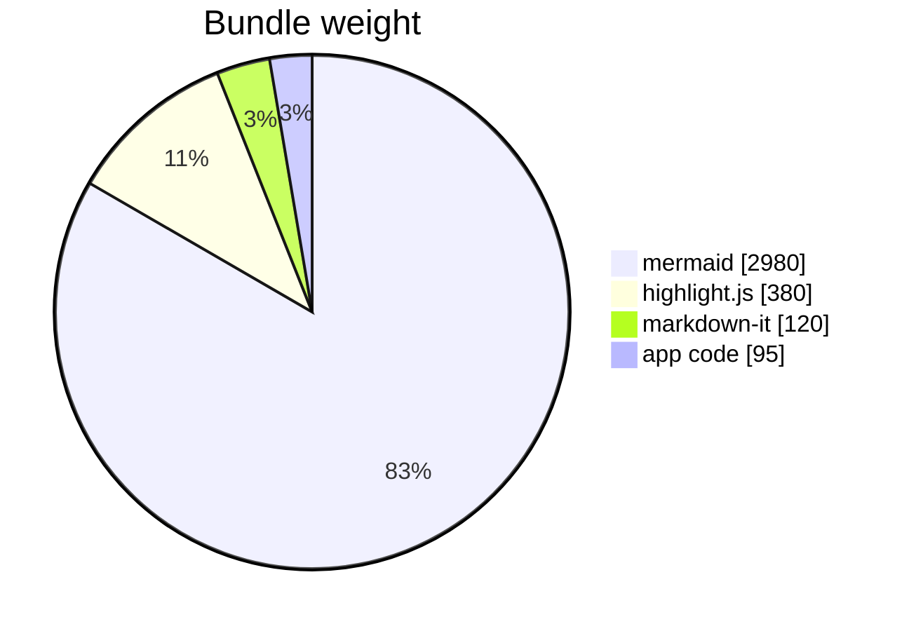
```mermaid
pie showData
    title Bundle weight
    "mermaid" : 2980
    "highlight.js" : 380
    "markdown-it" : 120
    "app code" : 95
```

## Quadrant

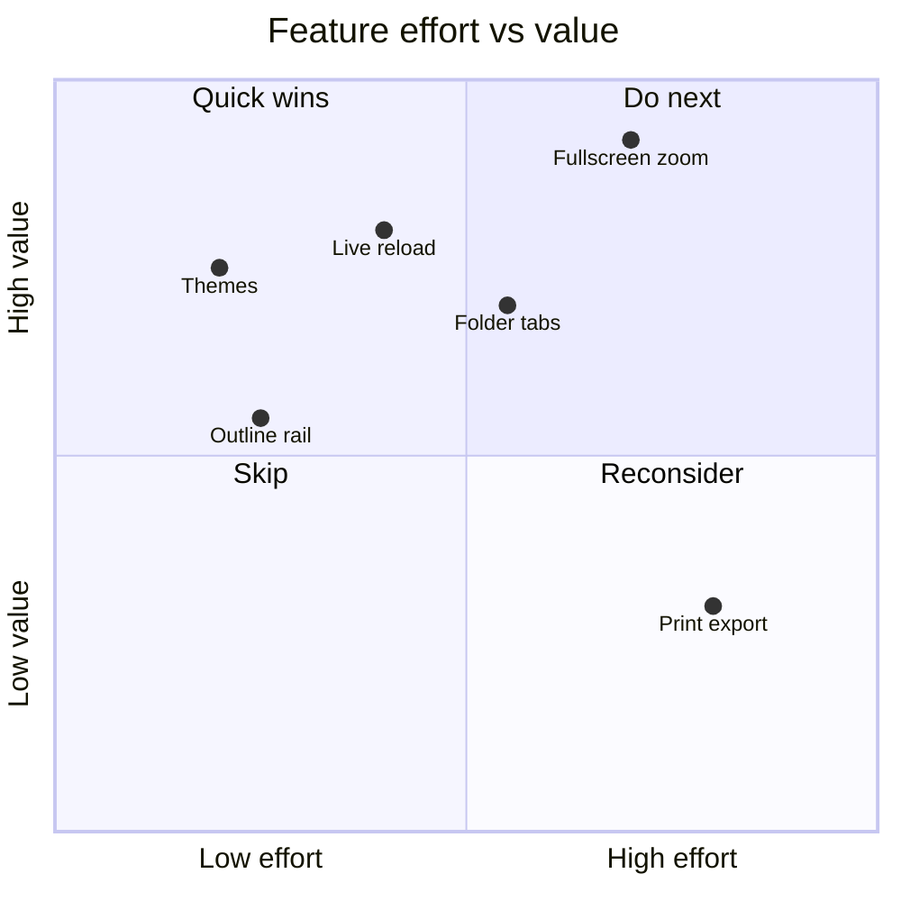
```mermaid
quadrantChart
    title Feature effort vs value
    x-axis Low effort --> High effort
    y-axis Low value --> High value
    quadrant-1 Do next
    quadrant-2 Quick wins
    quadrant-3 Skip
    quadrant-4 Reconsider
    Fullscreen zoom: [0.7, 0.92]
    Live reload: [0.4, 0.8]
    Folder tabs: [0.55, 0.7]
    Outline rail: [0.25, 0.55]
    Print export: [0.8, 0.3]
    Themes: [0.2, 0.75]
```

## Requirements

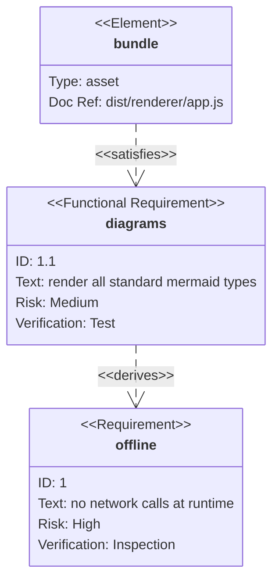
```mermaid
requirementDiagram
    requirement offline {
        id: 1
        text: no network calls at runtime
        risk: high
        verifymethod: inspection
    }
    functionalRequirement diagrams {
        id: 1.1
        text: render all standard mermaid types
        risk: medium
        verifymethod: test
    }
    element bundle {
        type: asset
        docref: dist/renderer/app.js
    }
    diagrams - derives -> offline
    bundle - satisfies -> diagrams
```

## Git graph

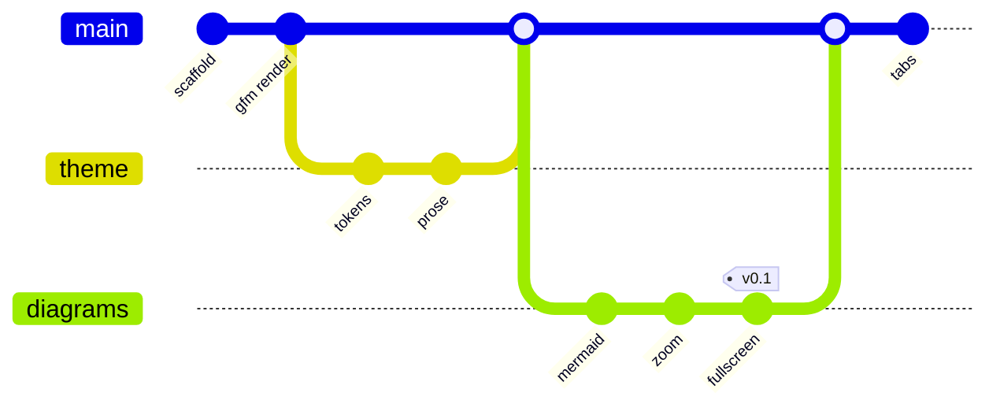
```mermaid
gitGraph
    commit id: "scaffold"
    commit id: "gfm render"
    branch theme
    checkout theme
    commit id: "tokens"
    commit id: "prose"
    checkout main
    merge theme
    branch diagrams
    commit id: "mermaid"
    commit id: "zoom"
    commit id: "fullscreen" tag: "v0.1"
    checkout main
    merge diagrams
    commit id: "tabs"
```

## Mindmap

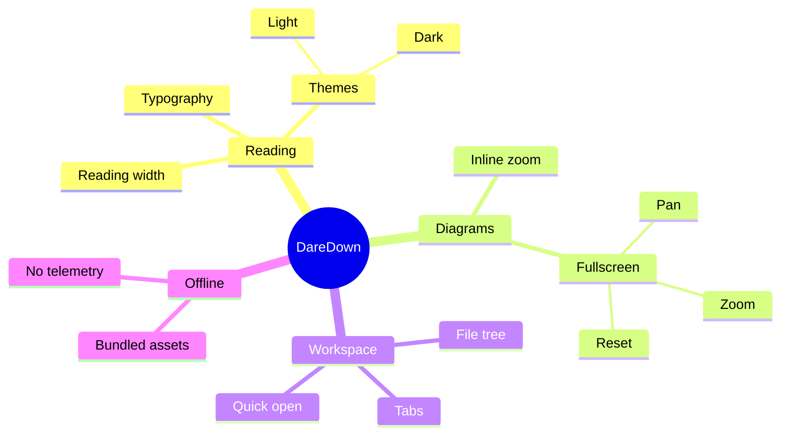
```mermaid
mindmap
  root((DareDown))
    Reading
      Typography
      Themes
        Light
        Dark
      Reading width
    Diagrams
      Inline zoom
      Fullscreen
        Pan
        Zoom
        Reset
    Workspace
      File tree
      Tabs
      Quick open
    Offline
      Bundled assets
      No telemetry
```

## Timeline

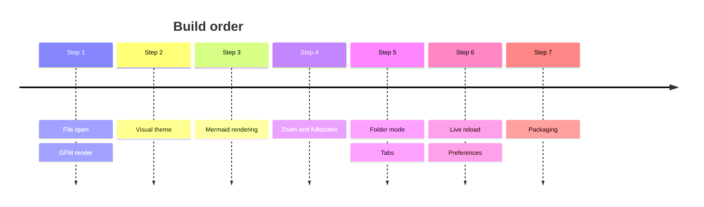
```mermaid
timeline
    title Build order
    Step 1 : File open : GFM render
    Step 2 : Visual theme
    Step 3 : Mermaid rendering
    Step 4 : Zoom and fullscreen
    Step 5 : Folder mode : Tabs
    Step 6 : Live reload : Preferences
    Step 7 : Packaging
```

## Sankey

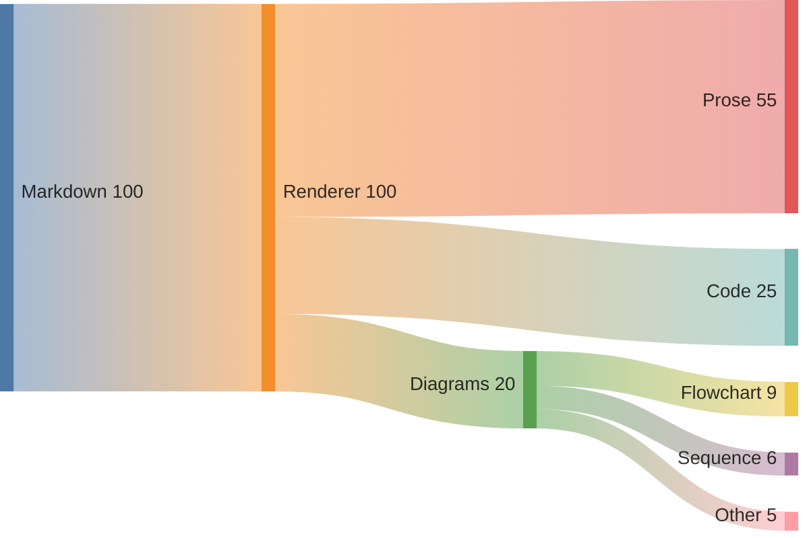
```mermaid
sankey-beta
Markdown,Renderer,100
Renderer,Prose,55
Renderer,Code,25
Renderer,Diagrams,20
Diagrams,Flowchart,9
Diagrams,Sequence,6
Diagrams,Other,5
```

## XY chart

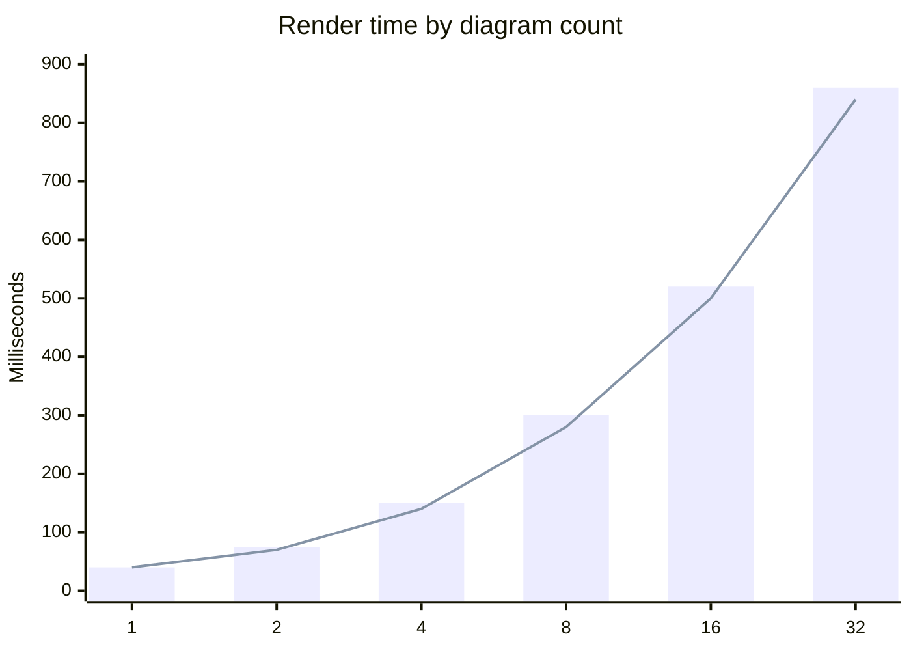
```mermaid
xychart-beta
    title "Render time by diagram count"
    x-axis [1, 2, 4, 8, 16, 32]
    y-axis "Milliseconds" 0 --> 900
    bar [40, 75, 150, 300, 520, 860]
    line [40, 70, 140, 280, 500, 840]
```

## Block

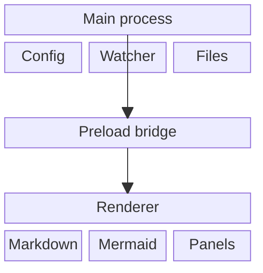
```mermaid
block-beta
    columns 3
    Main["Main process"]:3
    Config Watcher Files
    space:3
    Preload["Preload bridge"]:3
    space:3
    Renderer["Renderer"]:3
    Markdown Mermaid Panels
    Main --> Preload
    Preload --> Renderer
```

## C4 context

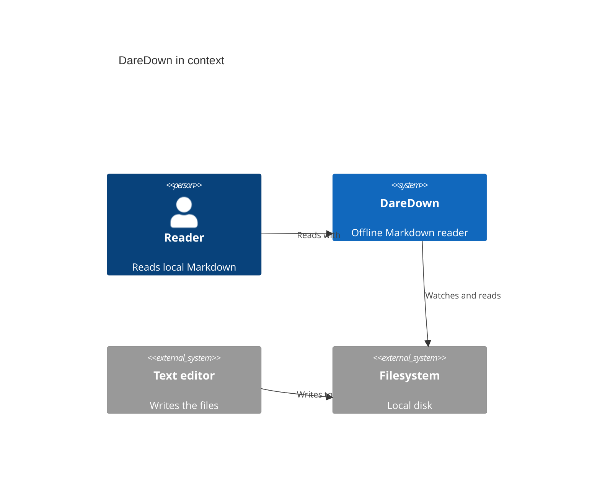
```mermaid
C4Context
    title DareDown in context
    Person(reader, "Reader", "Reads local Markdown")
    System(daredown, "DareDown", "Offline Markdown reader")
    System_Ext(editor, "Text editor", "Writes the files")
    System_Ext(fs, "Filesystem", "Local disk")
    Rel(reader, daredown, "Reads with")
    Rel(editor, fs, "Writes to")
    Rel(daredown, fs, "Watches and reads")
```

## Packet

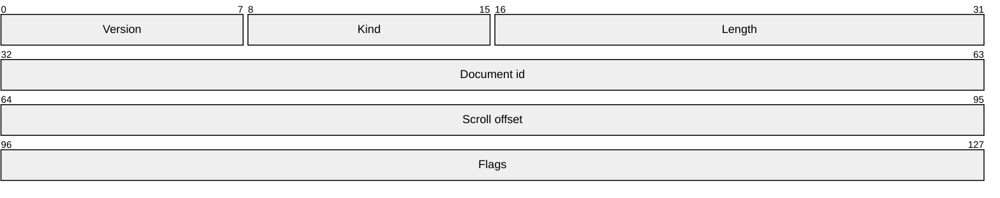
```mermaid
packet-beta
    0-7: "Version"
    8-15: "Kind"
    16-31: "Length"
    32-63: "Document id"
    64-95: "Scroll offset"
    96-127: "Flags"
```

## Architecture

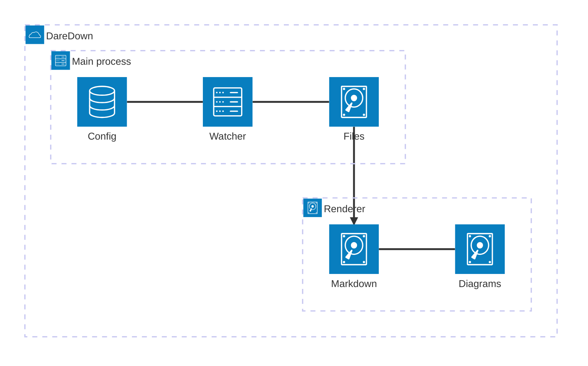
```mermaid
architecture-beta
    group app(cloud)[DareDown]
    group main(server)[Main process] in app
    group ui(disk)[Renderer] in app

    service cfg(database)[Config] in main
    service watch(server)[Watcher] in main
    service io(disk)[Files] in main
    service md(disk)[Markdown] in ui
    service mmd(disk)[Diagrams] in ui

    cfg:R -- L:watch
    watch:R -- L:io
    io:B --> T:md
    md:R -- L:mmd
```

## Kanban

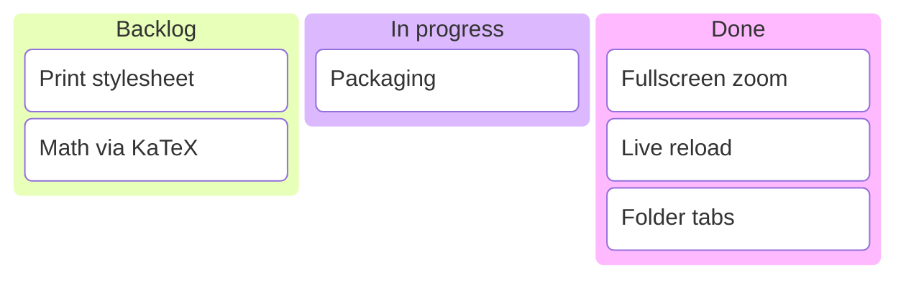
```mermaid
kanban
    Backlog
        task1[Print stylesheet]
        task2[Math via KaTeX]
    In progress
        task3[Packaging]
    Done
        task4[Fullscreen zoom]
        task5[Live reload]
        task6[Folder tabs]
```

## Radar

```mermaid
radar-beta
    title Reader qualities
    axis calm["Calm"], fast["Fast"], offline["Offline"]
    axis diagrams["Diagrams"], typography["Typography"]
    curve daredown["DareDown"]{90, 85, 100, 95, 90}
    curve editor["Code editor"]{40, 80, 70, 45, 50}
    max 100
    min 0
```

## Treemap

```mermaid
treemap-beta
"Bundle"
    "mermaid"
        "diagrams": 1900
        "core": 700
        "layout": 380
    "highlight.js": 380
    "markdown-it": 120
    "app": 95
```

## Deliberately broken

The block below has a syntax error, and should render as an inline error card
with the original source rather than taking the page down.

```mermaid
flowchart LR
    A --> --> B[[[
```
