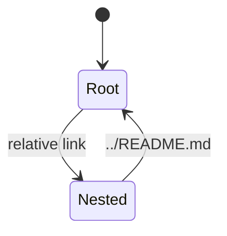

# A nested document

Reached from the root README by a relative link. Going back up:
[../README.md](../README.md), and a sibling: [neighbour](neighbour.md).

An extension-less link also resolves: [neighbour without .md](neighbour).

